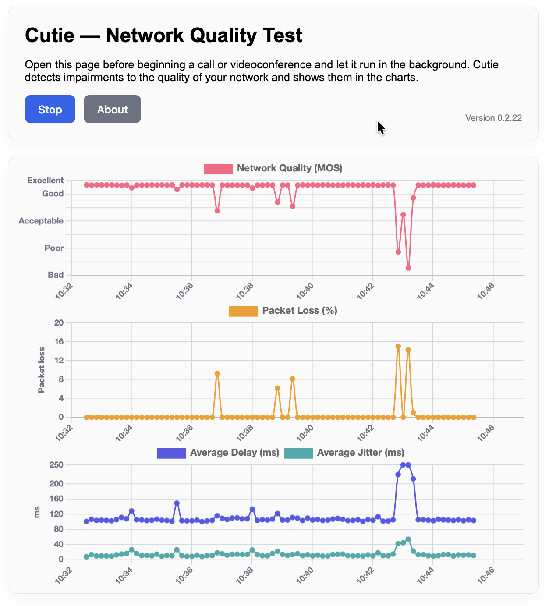

# Cutie - Network Quality Test

Cutie makes a Quality Test of your network.
It continually tests **Network Quality** (MOS - a measure of the quality of a voice or video call), **Packet Loss**, and **Latency/Jitter**.

Any impairments to the network appear in the graphs.
Cutie hardly uses any resources -
a little less than two kilobytes per second.
Here's a screenshot with description below:



_The charts above were created using a cell phone hotspot:
its relatively low speed link magnifies any impairments.
Here are the highlights._

- _The first few minutes (up to 10:37) show no-load conditions:
  no packet loss and stable latency of about 90msec.
  This leads to excellent Network Quality._
- _Around 10:39, begin a lively video on another computer.
  Note the brief packet loss
  (likely caused when starting the Youtube video)
  leads to dips in Network Quality.
  The latency and jitter remained fairly stable._
- _Around 10:42, run a speed test on that other computer.
  Notice that latency jumps up very high (over 250msec)
  for the duration of the speed test
  with a couple brief instances of packet loss.
  These cause the MOS Quality to plummet during the test._

## How it works

Cutie's WebRTC connection creates fine-grained measurements
by sending 10 probes per second, (every 100 ms).
The three charts display the 10-second average of
the values below:

- **Network Quality (MOS)**. The
  [Mean Opinion Score](./docs/Theory%20of%20Operation.md#mos-mean-opinion-score-calculations)
  is an industry standard that expresses the quality of a voice call
  (and by extension, of a videoconference call).
  The MOS calculation produces values between
  4.5 (excellent) and 1.0 (bad) and is computed using
  the packet loss, latency, and jitter measurements.

- **Packet Loss (%)** Cutie determines packet loss by detecting
  missing sequence numbers from the stream of echoed messages.

- **Latency & Jitter** Cutie computes the difference between
  time the message was received and the timestamp within the message
  to determine the latency for each message.
  It computes the jitter from the differences between
  arrival times of subsequent messages.

Note that Cutie measures the performance of the _entire_ network.
Traffic from other computers can affect
the measurements in the charts.

## Demo site

You can try Cutie from the demo site at
[https://cutie.richb-hanover.com](https://cutie.richb-hanover.com)

Notes:

- The base ICMP ping time to that server is about 35 ms
  (it's a pretty slow VPS).
  Consequently, Cutie's lowest latency tends to be
  about 35 ms.
- You could also install a Cutie server on a nearby
  computer to test your local network's abilities.

## Development and Testing

It is straightforward to install this code on Linux or macOS:

```bash
git clone https://github.com/richb-hanover/Cutie-network-Quality-Test.git
cd Cutie-network-Quality-Test
npm install
```

To run the code:

```bash
# to test from localhost:5173
npm run dev

# To leave a test server running
nohup npm run dev &
```

To start a **production server**, read the
[CHECKLIST](./docs/CHECKLIST.md) for details.

As noted in the [Theory of Operation](./docs/Theory%20of%20Operation.md),
this was initially developed in VSCode with the Codex LLM plugin.
Subsequent versions were developed using `obra/superpowers`
in the Warp terminal emulator.

## Known bugs

- I envision bundling `coturn` into a Docker container
  at some point to create a turnkey server
  along with netperf, iperf, iperf3, Crusader server, etc.
  This container could run on something small
  (like a Raspberry Pi 4)
  that could be dropped onto a network anywhere
  and used as a test platform.
- There are occasional surprises (errors) in the reported numbers
  as compared to values recorded in the charts.

## What's with the name "Cutie"?

It's a vaguely humorous pronunciation (for English speakers)
of "QT" for "Quality Test".
A saving grace is that "Cutie" seems not to have collisions
in a quick Google search for "cutie network test".

_NB: I am aware of the
[QT Graphics View Framework](https://qt.io)
that shares the same acronym "QT".
However, they pronounce it "cute"._

## Questions & Feedback

This is version 0.3.1, and is beta-test quality code.
Read the
[Provenance - Vibe Engineering](./docs/Theory%20of%20Operation.md#provenance---vibe-engineering)
information to see how this was derived,
as well as the `obra/superpowers` documents in _docs/plans_.

I would be pleased to get feedback or bug reports on the
[Issues](https://github.com/richb-hanover/Cutie-network-Quality-Test/issues)
page.
